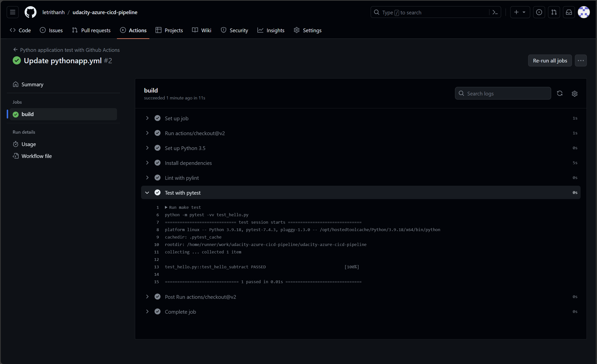

# Overview

This web application is designed to predict home prices using machine learning models built with Scikit-learn (Sklearn). It provides information for homeowners, potential buyers, and real estate professionals to estimate the market value of a property based on various factors.

## Project Plan

https://trello.com/b/5osl47za/personal

https://docs.google.com/spreadsheets/d/1VGkJfx3uP8nUzYiEm0lB8n4wnkwZNl2MLHOK__5Y7H8/edit?usp=sharing

## Instructions


### How to run the project
```bash
# Prepare environment
make setup

# Activate the environment
source ~/.udacity-devops/bin/activate

# Install dependencies
make install

# Start the application
python app.py
```

Project running on Azure App Service


Project cloned into Azure Cloud Shell


Passing tests that are displayed after running the `make all` command from the `Makefile`


Output of a test run



Successful deploy of the project in Azure Pipelines.  [Note the official documentation should be referred to and double checked as you setup CI/CD](https://docs.microsoft.com/en-us/azure/devops/pipelines/ecosystems/python-webapp?view=azure-devops).


Running Azure App Service from Azure Pipelines automatic deployment


Successful prediction from deployed flask app in Azure Cloud Shell.  [Use this file as a template for the deployed prediction](https://github.com/udacity/nd082-Azure-Cloud-DevOps-Starter-Code/blob/master/C2-AgileDevelopmentwithAzure/project/starter_files/flask-sklearn/make_predict_azure_app.sh).


Output of streamed log files from deployed application


## Enhancements

* Model Performance: Improve data, features, hyperparameters, consider new models.
* User Experience: Add visualizations, recommendations, maps, feedback system.
* Data Integration: Connect with databases, APIs, incorporate new data sources.
* Application Functionality: Add authentication, recommendations, saved searches, agent/lender integration.
* Deployment and Scalability: Deploy to cloud platform, implement load balancing/caching, monitor performance, continuous integration/deployment.
* Additional Enhancements: Chatbot, mobile app, social media integration, AI-powered features.

## Demo 

https://www.youtube.com/watch?v=gXOOgRWZSPo


